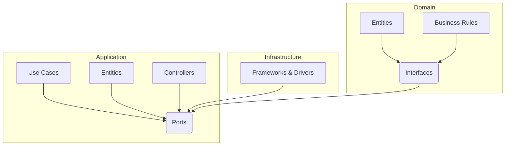
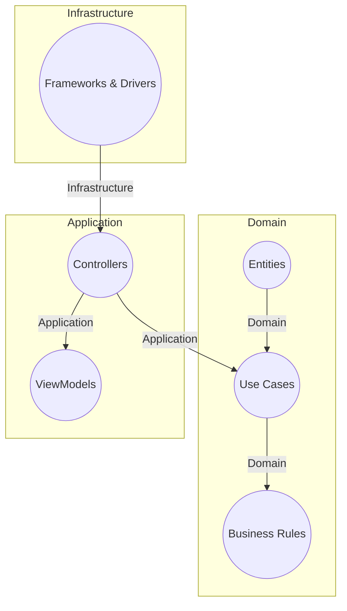
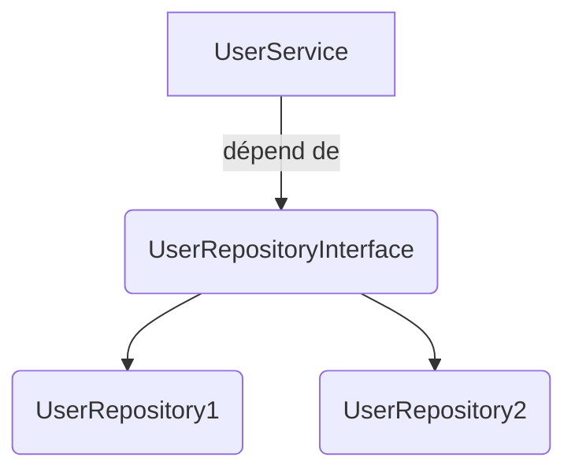
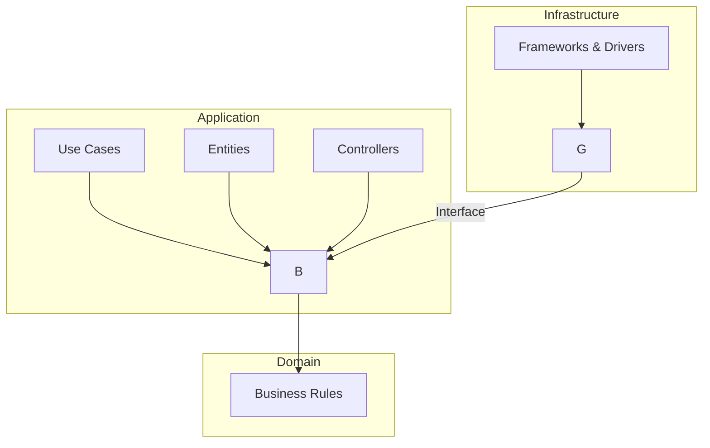
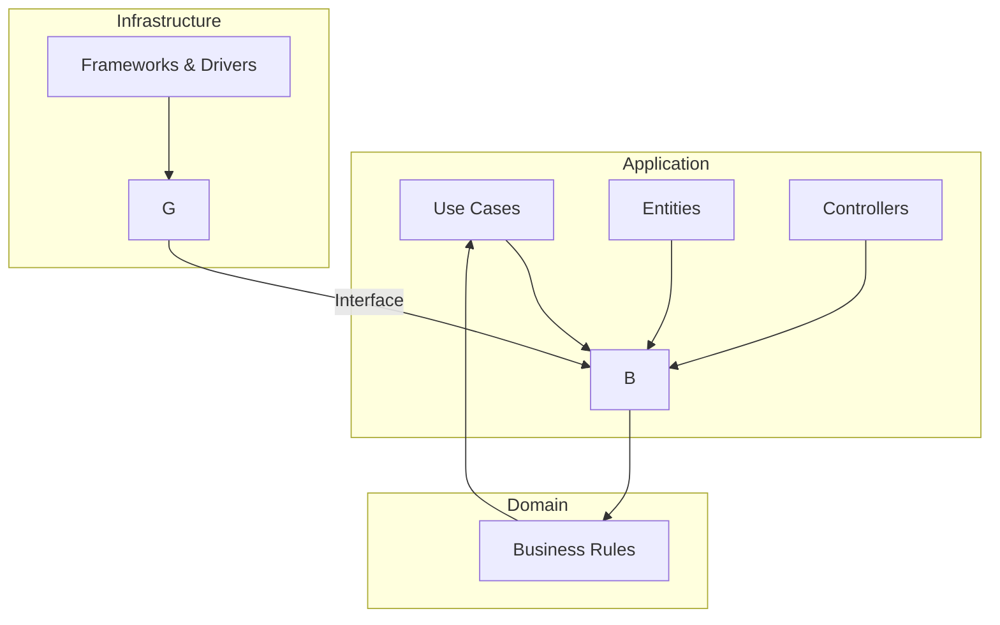
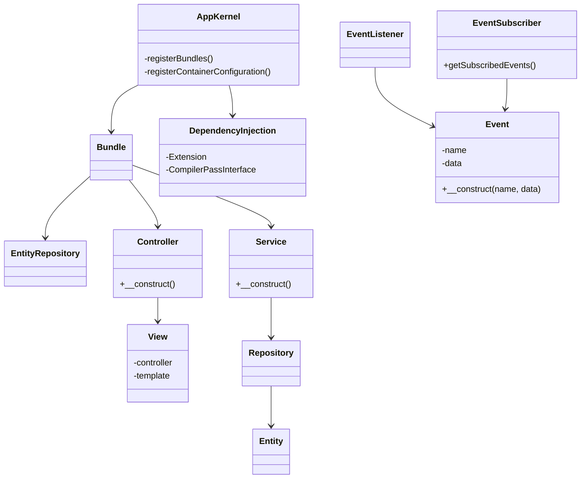
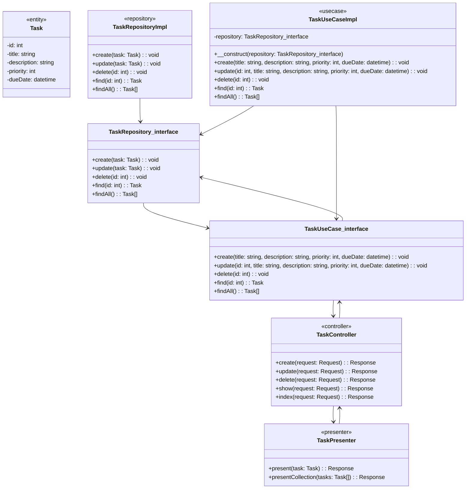

# [Tansoftware](https://www.tansoftware.com) - Clean architecture : Hexagonale 

# Table des matières

* [Introduction](#introduction)
* [Principes de la Clean Architecture](#principes-de-la-clean-architecture)
* [Le pattern Hexagonal](#le-pattern-hexagonal)
* [Les différentes couches](#les-différentes-couches)
* [L'inversion de dépendance](#linversion-de-dépendance)
* [Le test-driven development](#le-test-driven-development)
* [Symfony en hexagonale](#symfony-en-hexagonale)

## Introduction

La clean architecture est un concept de développement logiciel qui a été introduit par l'ingénieur en logiciel [Robert C. Martin](http://cleancoder.com/products) en 2012. Elle est basée sur l'idée que l'architecture d'une application doit être conçue pour être indépendante des détails de mise en œuvre tels que la base de données, l'interface utilisateur et les frameworks utilisés.

L'architecture propre vise à produire des systèmes logiciels qui sont hautement testables, évolutifs et maintenables tout au long de leur durée de vie. Elle repose sur plusieurs principes de conception tels que la séparation des préoccupations, la modularité, l'inversion de dépendance et la cohérence conceptuelle.

Elle permet une plus grande flexibilité et une plus grande facilité à faire évoluer l'application, chaque couche pouvant être testée et développée de manière autonome. 

[🔝 Retour en haut de page](#table-des-matières)

## Principes de la Clean Architecture
La Clean Architecture repose sur plusieurs principes fondamentaux permettant de concevoir des systèmes évolutifs, maintenables, testables et indépendants des frameworks. Parmi ces principes, on peut citer :
-   La séparation des préoccupations : chaque partie du système doit être responsable d'une seule chose, ce qui permet d'éviter les interactions non désirées et de faciliter les modifications.
-   L'indépendance des frameworks : le code métier ne doit pas dépendre d'un framework spécifique, pour permettre de changer de framework facilement si nécessaire.
-   La testabilité : le code doit être facilement testable pour garantir son bon fonctionnement.
-   L'évolutivité : le système doit être conçu pour être évolutif et pour permettre l'ajout de nouvelles fonctionnalités facilement.
-   La lisibilité : le code doit être lisible pour permettre à d'autres développeurs de comprendre rapidement ce qui se passe et de le maintenir facilement.
-   La simplicité : le système doit être conçu de manière simple, pour éviter les problèmes de complexité qui peuvent survenir à long terme.

Le respect de ces principes permet de créer des architectures applicatives robustes, indépendantes et évolutives. Le diagramme le plus adapté pour représenter ces principes est un diagramme en couches, qui permet de visualiser la séparation des préoccupations et l'indépendance des frameworks.

[🔝 Retour en haut de page](#table-des-matières)

## Le pattern Hexagonal
Le pattern Hexagonal est une architecture logicielle qui vise à organiser les composants d'une application (les classes, les modules, les fonctions, etc) en **couches** et à **isoler** la logique métier de l'application des détails techniques tels que la persistance des données ou l'interface utilisateur.

Le cœur du pattern Hexagonal réside dans la création d'une couche centrale, appelée **"domain" ou "business logic"**, qui contient les [règles métiers](https://fr.wikipedia.org/wiki/R%C3%A8gles_m%C3%A9tier) et les [cas d'utilisation](https://fr.wikipedia.org/wiki/Cas_d%27utilisation) de l'application. Cette couche centrale est entièrement indépendante des autres couches et communique uniquement avec elles par le biais de ports d'entrée/sortie définis.

La couche **d'infrastructure**, qui contient les détails techniques de l'application tels que la persistance des données, la communication réseau, etc., communique avec la couche centrale via des adaptateurs qui implémentent les ports définis.

La couche de **présentation**, qui gère l'interface utilisateur de l'application, communique également avec la couche centrale via des adaptateurs.

### Modèle d'architecture hexagonale
La couche centrale est représentée par l'hexagone intérieur, tandis que les couches d'infrastructure et de présentation sont représentées par les hexagones extérieurs. Les adaptateurs sont représentés par les flèches reliant les différentes couches.

[🔝 Retour en haut de page](#table-des-matières)

## Les différentes couches
L'architecture hexagonale repose sur une organisation en différentes couches, chacune ayant une **responsabilité spécifique** dans l'application. Ces couches sont généralement les suivantes :

### La couche de présentation

La couche de présentation est responsable de l'interface utilisateur de l'application. Elle reçoit les requêtes de l'utilisateur, les traite, et retourne les réponses correspondantes. Cette couche peut être implémentée sous différentes formes, telles que des pages web, des applications mobiles, ou des interfaces en ligne de commande.

### La couche d'application

La couche d'application est responsable de la logique métier de l'application. Elle reçoit les requêtes de la couche de présentation, traite ces requêtes en utilisant les services de la couche de domaine, et retourne les réponses correspondantes à la couche de présentation.

### La couche de domaine

La couche de domaine contient les règles métier de l'application, ainsi que les entités qui les utilisent. Elle est indépendante des détails techniques de l'application, tels que la persistance des données ou l'interface utilisateur, et peut donc être testée de manière isolée.

### La couche d'infrastructure

La couche d'infrastructure est responsable de la gestion des détails techniques de l'application, tels que la persistance des données, la communication avec des services externes, ou encore la gestion des erreurs. Elle utilise les services définis dans la couche de domaine pour réaliser ces tâches, et communique avec la couche de présentation via des adaptateurs.
____
Chacune de ces couches a un rôle spécifique dans l'application, et leur découpage permet de favoriser la modularité, la maintenabilité, et la testabilité de celle-ci.

### Représentation graphique
Ce diagramme représente les trois couches principales de la Clean Architecture : le Domain, l'Application et l'Infrastructure. Les flèches indiquent les dépendances entre les couches.

Dans le Domain, nous avons les entités métier, les cas d'utilisation et les règles métier. Dans l'Application, nous avons les contrôleurs et les view models, qui sont responsables de la gestion des interactions entre les utilisateurs et le système. 

Enfin, dans l'Infrastructure, nous avons les frameworks et les drivers, qui gèrent les détails techniques de l'application, tels que la persistance des données, la communication réseau, etc.

Les flèches dans le diagramme représentent les dépendances entre les différentes couches de l'architecture hexagonale. 

Les flèches qui vont de l'infrastructure vers l'application indiquent que l'infrastructure dépend de l'application, c'est-à-dire que les éléments de l'infrastructure doivent connaître les éléments de l'application pour fonctionner correctement. 

Par exemple, la persistance des données dépend des entités métier de l'application, car c'est sur ces entités que ces opérations sont effectuées.

[🔝 Retour en haut de page](#table-des-matières)

## L'inversion de dépendance
Ce principe consiste à inverser les dépendances entre les différentes couches de l'application. Les couches supérieures ne dépendent pas des couches inférieures, mais plutôt de contrats et d'interfaces définis par ces couches inférieures.

Le but de l'inversion de dépendance est de permettre à chaque couche de l'application de rester indépendante et interchangeable, ainsi si une couche inférieure change (par exemple, la couche d'infrastructure pour la persistance des données), cela n'aura pas d'impact sur les couches supérieures (par exemple, la couche de présentation ou la couche de logique métier).

### Exemple
Imaginons que nous ayons une classe `UserService` qui dépend directement d'une classe `UserRepository` pour effectuer des opérations sur les utilisateurs dans une base de données. Si nous voulons changer la base de données utilisée ou même simplement les requêtes SQL effectuées, cela aura un impact direct sur la classe `UserService` et nécessitera des modifications dans son code.

Au lieu de cela, nous pouvons utiliser une interface `UserRepositoryInterface` qui définit les opérations possibles sur les utilisateurs, et faire en sorte que la classe `UserService` dépende de cette interface plutôt que de la classe concrète `UserRepository`. Ainsi, nous pouvons facilement changer l'implémentation de cette interface sans avoir à modifier la classe `UserService`.

### Context
Dans le contexte de la Clean Hexagonale, l'inversion de dépendance permet de respecter le principe de la séparation des préoccupations en garantissant que les détails techniques de l'application sont isolés des règles métiers. Cela permet également de faciliter les tests unitaires en permettant de tester chaque couche indépendamment des autres.

[🔝 Retour en haut de page](#table-des-matières)

## Le test-driven development
Le TDD en Clean Architecture est un processus itératif de développement logiciel dans lequel chaque composant de l'application est testé de manière isolée à l'aide de tests unitaires.

Les tests sont la principale force motrice de la conception de l'application et visent à être un guide jusqu'à l'itération fonctionnelle du code production.

Ainsi, le principe consiste à conceptualiser le besoin, écrire un premier test simpliste, écrire le code de production correspondant pour répondre à ce test, et itérer jusqu'à ce que l'objectif soit atteint. 

Une fois cet objectif atteint, un autre cas de test peut être écrit pour la même fonctionnalité afin de couvrir différents scénarios ou besoins. Cela permet de s'assurer que le code développé répond à l'ensemble des exigences de l'application

### Structure en couches
Pour illustrer cela, le diagramme suivant indique avec une flèche en boucle entre les couches, la représentation itérative du TDD.

[🔝 Retour en haut de page](#table-des-matières)

## Symfony en hexagonale
Ce diagramme représente les différentes classes principales d'une application Symfony, telles que le `AppKernel` qui permet d'enregistrer les bundles, les `Bundle` qui contiennent des services, des contrôleurs et des entités, les `Service` qui contiennent la logique métier, les `Controller` qui gèrent les requêtes HTTP, les `View` qui sont les templates associés aux contrôleurs, les `Entity` qui représentent les objets métier et les `Repository` qui permettent de les manipuler en base de données. Le diagramme inclut également les classes associées à la gestion des événements, avec les `Event`, les `EventListener` et les `EventSubscriber`.

### Exemple concret : une application de gestion de tâches
Imaginons une application permettant de créer et gérer des tâches avec des priorités et des dates d'échéance, disposant également d'une fonctionnalité de recherche et d'une interface utilisateur pour l'ajout et la modification des tâches.

### Architecture générale de l'application
Voici une représentation possible de l'architecture générale de l'application

### Description
-   `Task` : une entité représentant une tâche, qui contient des attributs tels que `id`, `title`, `description`, `priority`, et `dueDate`.
-   `TaskRepository_interface` : une interface qui définit les méthodes pour la couche d'infrastructure qui communique avec la couche centrale.
-   `TaskUseCase_interface` : une interface qui définit les méthodes pour la couche centrale qui contient les règles métier de l'application.
-   `TaskController` : une classe qui gère les requêtes HTTP de l'utilisateur et les transmet à la couche centrale pour effectuer les opérations appropriées.
-   `TaskPresenter` : une classe qui gère la présentation des résultats renvoyés par la couche centrale pour être envoyés au client (sous forme de réponse HTTP).
-   `TaskRepositoryImpl` : une classe qui implémente l'interface `TaskRepository_interface` pour fournir les méthodes de communication avec la base de données.
-   `TaskUseCaseImpl` : une classe qui implémente l'interface `TaskUseCase_interface` pour fournir les méthodes de la couche centrale, en utilisant le repository pour persister les données.

[🔝 Retour en haut de page](#table-des-matières)
