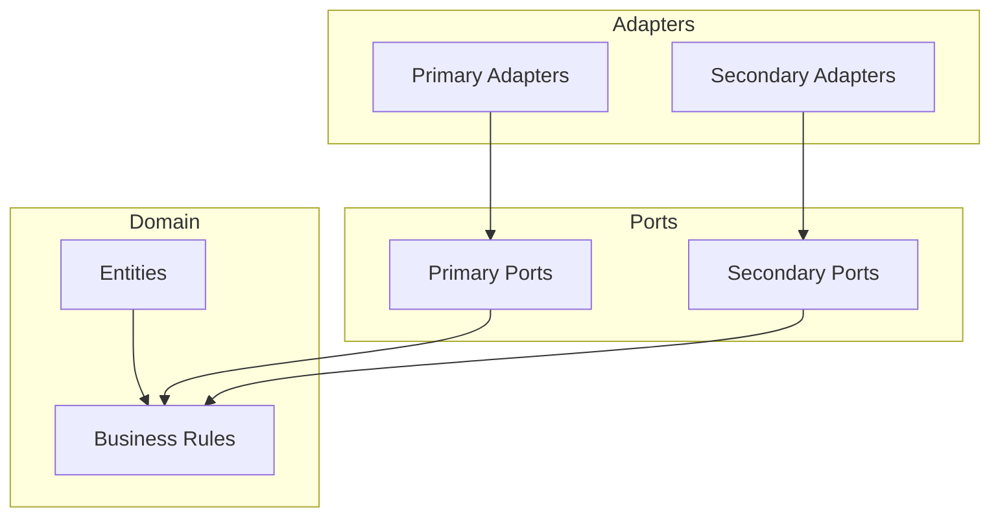
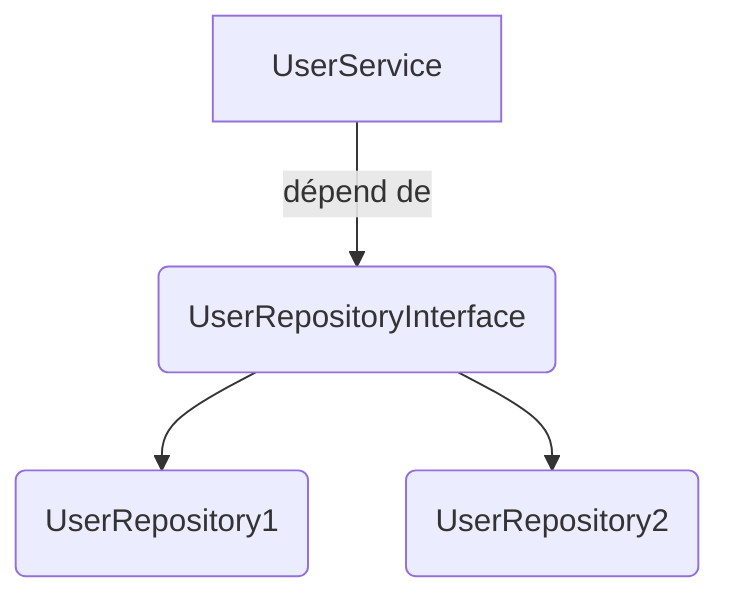
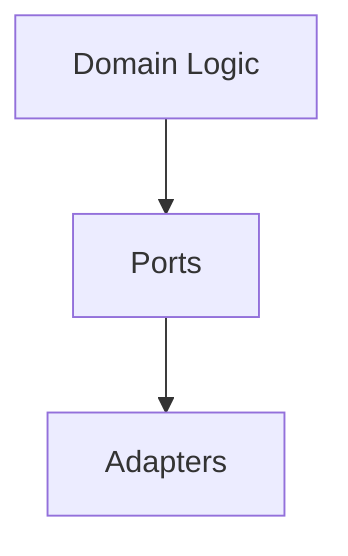
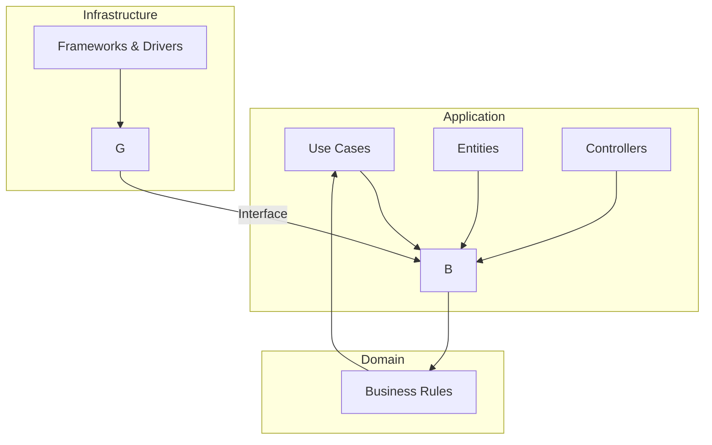
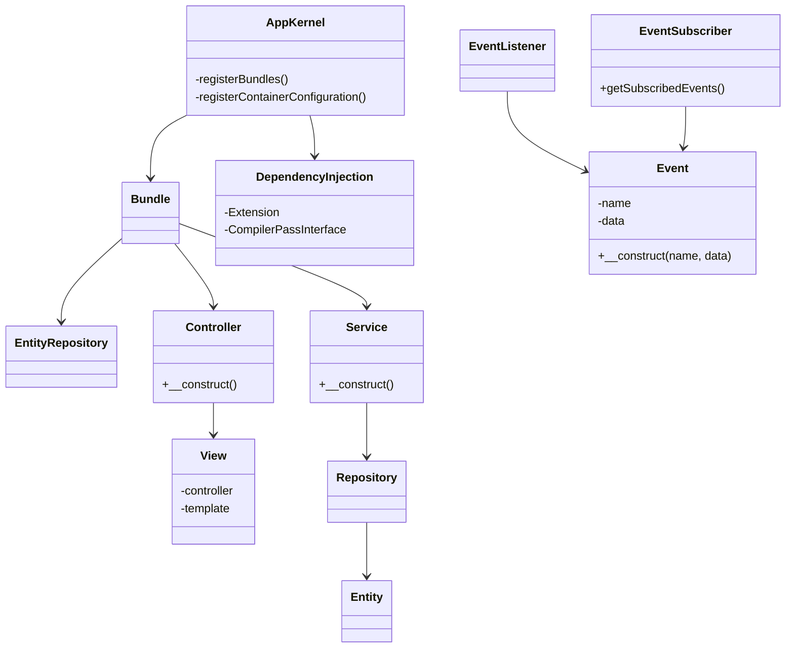
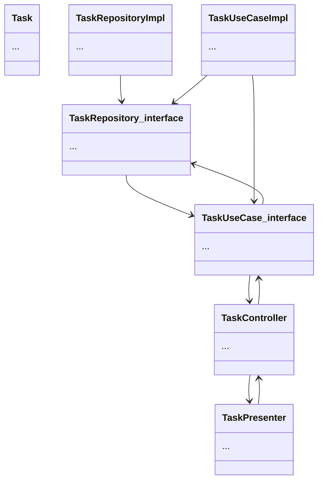

# [Tansoftware](https://www.tansoftware.com) - architecture : Hexagonale 

# Table des matières

* [Introduction](#introduction)
* [Les différentes couches](#les-différentes-couches)
* [L'inversion de dépendance](#linversion-de-dépendance)
* [Le test-driven development](#le-test-driven-development)
* [Symfony en hexagonale](#symfony-en-hexagonale)

## Introduction

L'architecture hexagonale est une architecture logicielle qui vise à découpler la logique métier de l'application des détails techniques tels que la persistance des données ou l'interface utilisateur.

Au cœur de l'architecture hexagonale se trouve le domaine, qui contient les règles métiers et les cas d'utilisation de l'application. Le domaine est entouré de ports, qui définissent les contrats pour interagir avec le monde extérieur, et d'adaptateurs, qui implémentent ces contrats.

### Modèle d'architecture hexagonale
La couche centrale est représentée par l'hexagone intérieur, tandis que les couches d'infrastructure et de présentation sont représentées par les hexagones extérieurs. Les adaptateurs sont représentés par les flèches reliant les différentes couches.

[🔝 Retour en haut de page](#table-des-matières)

## Les différentes couches
L'architecture hexagonale repose sur une organisation en différentes couches, chacune ayant une **responsabilité spécifique** dans l'application. Ces couches sont généralement les suivantes :

### Le cœur de l'application (Domaine)
Au centre de cette architecture se trouve le cœur de l'application, qui contient la logique métier et les entités. Cette partie est totalement indépendante des détails techniques et des interfaces externes, ce qui la rend facilement testable.

### Ports
Les ports définissent les contrats ou interfaces par lesquels le cœur de l'application interagit avec le monde extérieur. Il existe généralement deux types de ports :

### Ports primaires
Ils définissent les fonctionnalités fournies par le cœur de l'application. Par exemple, une API pour créer un nouvel utilisateur.

### Ports secondaires
Ils définissent les fonctionnalités attendues par le cœur de l'application mais implémentées à l'extérieur, comme l'accès à une base de données.

## Adaptateurs

## Les adaptateurs (adapter en anglais) sont des implémentations concrètes des ports. 
Ils "adaptent" les interfaces externes (comme une base de données, une interface utilisateur ou un service web) pour qu'elles puissent communiquer avec le cœur de l'application via les ports.

### Adaptateurs primaires
Les adaptateurs primaires reçoivent des requêtes du monde extérieur (comme une interface utilisateur ou une API externe) et les transmettent au cœur de l'application via les ports primaires. Ils sont responsables de la conversion des données entrantes en un format que le domaine peut comprendre.

### Adaptateurs secondaires
Les adaptateurs secondaires implémentent les fonctionnalités définies par les ports secondaires. Ils sont responsables de la communication avec les systèmes externes, tels que les bases de données, les services de messagerie, etc. Ils adaptent ces systèmes externes pour qu'ils puissent interagir avec le cœur de l'application via les ports secondaires.

### Représentation graphique
Ce diagramme représente les trois couches principales de la Clean Architecture : le Domain, l'Application et l'Infrastructure. Les flèches indiquent les dépendances entre les couches.

Dans le Domain, nous avons les entités métier, les cas d'utilisation et les règles métier. Dans l'Application, nous avons les contrôleurs et les view models, qui sont responsables de la gestion des interactions entre les utilisateurs et le système. 

Enfin, dans l'Infrastructure, nous avons les frameworks et les drivers, qui gèrent les détails techniques de l'application, tels que la persistance des données, la communication réseau, etc.

Les flèches dans le diagramme représentent les dépendances entre les différentes couches de l'architecture hexagonale. 

Les flèches qui vont de l'infrastructure vers l'application indiquent que l'infrastructure dépend de l'application, c'est-à-dire que les éléments de l'infrastructure doivent connaître les éléments de l'application pour fonctionner correctement. 

Par exemple, la persistance des données dépend des entités métier de l'application, car c'est sur ces entités que ces opérations sont effectuées.

[🔝 Retour en haut de page](#table-des-matières)

## L'inversion de dépendance
Ce principe consiste à inverser les dépendances entre les différentes composantes de l'application. Dans l'architecture hexagonale, les adaptateurs dépendent des ports, et les ports dépendent du domaine. Cela permet d'isoler la logique métier et de rendre les composantes extérieures interchangeables.

### Exemple
Imaginons que nous ayons une classe `UserService` qui dépend directement d'une classe `UserRepository` pour effectuer des opérations sur les utilisateurs dans une base de données. Si nous voulons changer la base de données utilisée ou même simplement les requêtes SQL effectuées, cela aura un impact direct sur la classe `UserService` et nécessitera des modifications dans son code.

Au lieu de cela, nous pouvons utiliser une interface `UserRepositoryInterface` qui définit les opérations possibles sur les utilisateurs, et faire en sorte que la classe `UserService` dépende de cette interface plutôt que de la classe concrète `UserRepository`. Ainsi, nous pouvons facilement changer l'implémentation de cette interface sans avoir à modifier la classe `UserService`.

### Context
Dans le contexte de l'architecture hexagonale, l'inversion de dépendance permet de respecter le principe de la séparation des préoccupations en garantissant que les détails techniques de l'application sont isolés des règles métiers. Cela permet également de faciliter les tests unitaires en permettant de tester chaque couche indépendamment des autres.

L'architecture hexagonale se concentre sur la création de ports et d'adaptateurs pour séparer la logique métier de l'application des détails techniques. Les ports définissent les contrats que les adaptateurs doivent respecter, et les adaptateurs implémentent ces contrats pour interagir avec les différentes parties de l'application.

Exemple

[🔝 Retour en haut de page](#table-des-matières)

## Le test-driven development
Le TDD est un processus itératif de développement logiciel dans lequel chaque composant de l'application est testé de manière isolée à l'aide de tests unitaires. Bien que le TDD ne soit pas spécifique à l'architecture hexagonale, il peut être utilisé en conjonction avec celle-ci pour assurer une conception robuste et bien testée.

### Structure en couches
Pour illustrer cela, le diagramme suivant indique avec une flèche en boucle entre les couches, la représentation itérative du TDD.

[🔝 Retour en haut de page](#table-des-matières)

## Symfony en hexagonale
Ce diagramme représente les différentes classes principales d'une application Symfony, telles que le `AppKernel` qui permet d'enregistrer les bundles, les `Bundle` qui contiennent des services, des contrôleurs et des entités, les `Service` qui contiennent la logique métier, les `Controller` qui gèrent les requêtes HTTP, les `View` qui sont les templates associés aux contrôleurs, les `Entity` qui représentent les objets métier et les `Repository` qui permettent de les manipuler en base de données. Le diagramme inclut également les classes associées à la gestion des événements, avec les `Event`, les `EventListener` et les `EventSubscriber`.

### Exemple concret : une application de gestion de tâches
Imaginons une application permettant de créer et gérer des tâches avec des priorités et des dates d'échéance, disposant également d'une fonctionnalité de recherche et d'une interface utilisateur pour l'ajout et la modification des tâches.

### Architecture générale de l'application
Voici une représentation possible de l'architecture générale de l'application

### Description
-   `Task` : une entité représentant une tâche, qui contient des attributs tels que `id`, `title`, `description`, `priority`, et `dueDate`.
-   `TaskRepository_interface` : une interface qui définit les méthodes pour la couche d'infrastructure qui communique avec la couche centrale.
-   `TaskUseCase_interface` : une interface qui définit les méthodes pour la couche centrale qui contient les règles métier de l'application.
-   `TaskController` : une classe qui gère les requêtes HTTP de l'utilisateur et les transmet à la couche centrale pour effectuer les opérations appropriées.
-   `TaskPresenter` : une classe qui gère la présentation des résultats renvoyés par la couche centrale pour être envoyés au client (sous forme de réponse HTTP).
-   `TaskRepositoryImpl` : une classe qui implémente l'interface `TaskRepository_interface` pour fournir les méthodes de communication avec la base de données.
-   `TaskUseCaseImpl` : une classe qui implémente l'interface `TaskUseCase_interface` pour fournir les méthodes de la couche centrale, en utilisant le repository pour persister les données.

[🔝 Retour en haut de page](#table-des-matières)
